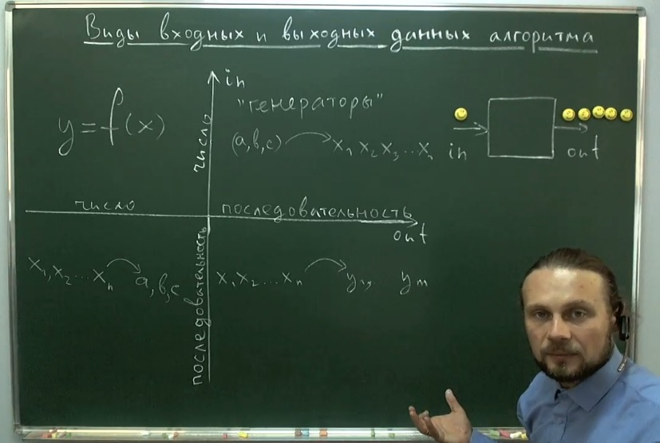

## Виды входных и выходных данных алгоритма.

На рисунке изображены диаграмма в виде координатных осей и Тимофей Хирьянов. 
Оси диаграммы обозначены как 
- **in** - входные данные
- **out** - выходные данные

1. Самый простой вид алгоритмов (верх-лево) может быть обозначен как **y = f(x)**. Это когда, например, мы на вход подаём одно число, а навыходе получаем другое.
2. Другие алгоритмы (верх-право) можно назвать **алгоритмы-генераторы** или **генерирующие алгоритмы**. В этих алгоритмах на вход подаётся одно число или некоторое фиксированное колличество чисел, а на выходе мы получаем некоторую последовательность чисел.
3. Ещё один вид алгоритмов (низ-лево), это когда у нас на входе есть некоторая последовательность, которую мы анализируем и на выходе получаем фиксированное колличество чисел.
4. Четвёртый вид алгоритмов (низ-право), это когда на входе и на выходе мы получаем последовательности чисел. При этом здесь и колличество чисел и их значение, всё может поменяться.
Как пример этих алгоритмов можно привести накладывание функции на каждый входной элемент последовательности (f(x1), f(x2)...f(xn)). Например возведение в квадрат каждого их входных элементов.
Другой пример это фильтрация входных элементов по определённому алгоритму (чётные-нечётные, простые или нет и т.д.).