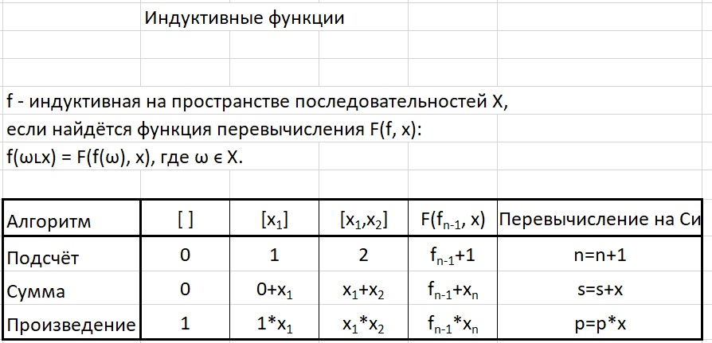

## Индуктивные функции



**Индуктивная функция** — это такая функция, значение которой для всего списка можно легко пересчитать, когда в конец списка добавляется новый элемент.

1. **Функция "Подсчёт"** (Длина списка)

Начальное значение для пустого списка: 0 (в пустом списке 0 элементов).
Когда приходит новый элемент x, новое значение длины = старое значение длины + 1. Неважно, чему равен x, мы просто увеличиваем счетчик на 1. 

Формула: *F(fₙ₋₁, x) = fₙ₋₁ + 1*.  
На Си: ```n = n + 1;```

2. **Функция "Сумма"**  

Начальное значение для пустого списка: 0 (сумма ничего равна нулю).
Когда приходит новый элемент x, новая сумма = старая сумма + новый элемент x.

Формула: *F(fₙ₋₁, x) = fₙ₋₁ + xₙ*  
На Си: ```s = s + x;```

3. **Функция "Произведение"**  

Начальное значение для пустого списка: 1 (произведение ничего равно единице, так как умножение на 1 ничего не меняет).
Когда приходит новый элемент x, новое произведение = старое произведение * новый элемент x.

Формула: *F(fₙ₋₁, x) = fₙ₋₁ * xₙ*  
На Си: ```p = p * x;```

Суть индуктивной функции в том, что не нужно хранить весь список в памяти, чтобы что-то о нём посчитать. Достаточно помнить всего одну вещь — текущее значение функции (например, текущую сумму s). Когда приходит новый элемент, то по простой формуле F обновляем это текущее значение.