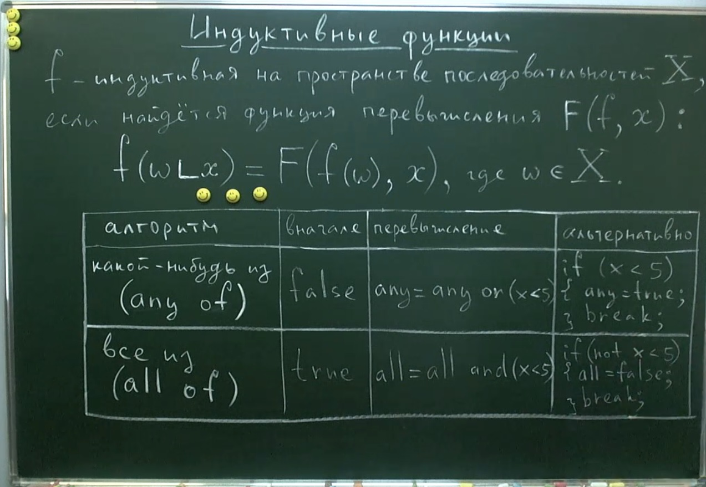

## Индуктивные функции

На рисунке представлены 2 алгоритма:  

**1. Какое-нибудь число соответствует критерию** (any of)  
**2. Все числа соответствуют критерию** (all of).

Начальные состояни для 1-го случая - **false**, т.е. не найдено ни одного числа соответствующего критерию. Функция перевычисления (индуктивная функция) будет выглядеть как **any = any || (x < 5)** (x < 5 - как пример), она работает на основе **логической суммы**. Здесь, когда найдено хотя бы одно число соответствующее критерию, **any** станет **true** и уже меняться не будет, соответственно поиск можно останавливать. Здесь полное совпадение с индуктивной функцией сложения.

Для 2-го случая - **true**, т.е. все числа в последовательности соответствуют критерию. Функция перевычисления (индуктивная функция) будет выглядеть как **all = all && (x < 5)**, она работает на основе **логического произведения**. Здесь, если все цифры в числе соответствуют критерию, то **all** останется **true**. Но если хотя бы одно число не будет соответствовать критерию, то **all** станет **false** и меняться уже не будет, соответственно поиск можно будет остановить. Здесь полное соответствие с индуктивной функцией умножения.