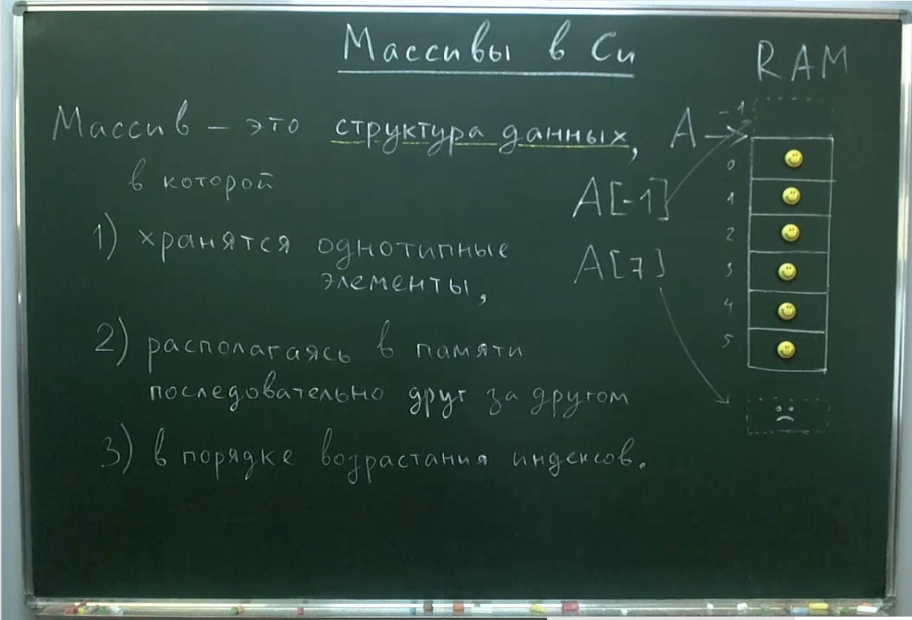

## Массивы в Си.



В Си номер первого элемента 0. Блок памяти для массива выделяется разом. И этот блок не рассматривается ОС как отдельные ячейки. Как отдельными они будут рассматриваться на этапе работы с ними.  

Язык Си не контролирует выход за границы массива при обращении к нему. Это справедливо как с положительными индексами по значению большими чем размер массива, так и с отрицательными индексами. Поэтому возможны случаи обращения к несуществующим или чужим ячейкам памяти.  

Но не смотря то, что массив является потенциально опасной структурой данных из-за возможности выхода за его границы и бесконтрольного доступа к памяти он является самой быстрой структурой данных которая только может быть в Си.

## Создание и заполнение массива на Си.

Чтобы создать массив нужно его объявить. Это значит указать тип хранимого элемента, выбрать имя для массива, в квадратных скобках указать колличество хранимых элементов, а индексы будут автоматически присваиваться от 0 до НЕ включительно числа хранимых элементов.

- **int A[6]** - 6 элементов, индексы от 0 до 5

Можно использовать переменные для инициализации массива, но содержимое этой переменной должно быть известно ранее чем будет объявлен массив.

```c
#define N 6

int A[N];
```
### Так же есть следующие варианты заполнения массива:

1. Вариант заполнения случайными данными
```c
#define N 6

int A[N];
```
В этом случае массив будет заполнен данными, которы уже имелись в памяти на момент её выделения.

2. Вариант заполнения последовательностью данных.

```c
#define N 6

int A[N] = {1, 2, 3, 4, 5, 6};
```
В этом случае массив будет заполнен нашими значениями.

3. Вариант заполнения нулями.

```c
#define N 6

int A[N] = {0};
```
