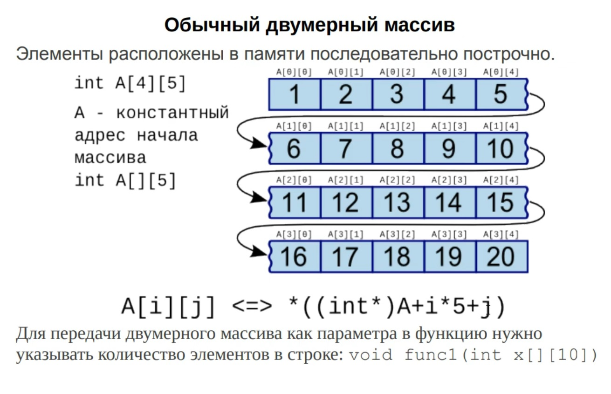
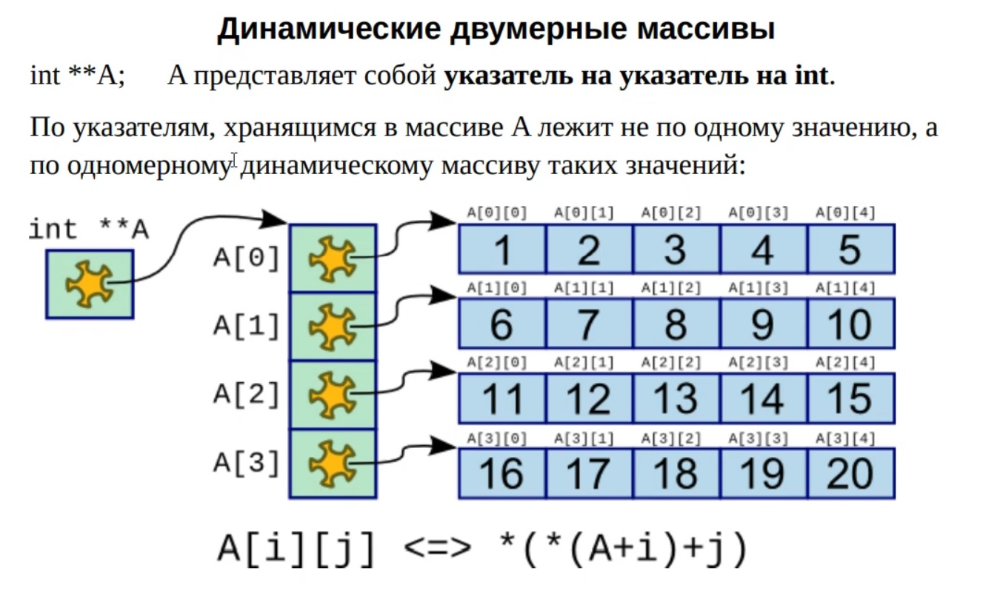

## Двумерные массивы: обычные и динамические.

### Обычный двумерный массив.


### Динамический двумерный массив.


### Варианты расмещения массивов в памяти.

В C массив может храниться в трёх местах:
- На стеке
- В динамической памяти (куча, heap)
- В статической / глобальной области  

Разница между ними — что управляет памятью и как долго она живёт.

**1. Массив на стеке.**

Примеры:
Статический двумерный массив на стеке:

```c
void f() {
    int A[10][20];
}
```

VLA (Variable Length Array) двумерный массив на стеке:

```c
int rows, cols;
scanf("%d %d", &rows, &cols);
int A[rows][cols]; // VLA — тоже на стеке
```

Характеристики стека:
- Память выделяется автоматически при входе в функцию.
- Освобождается автоматически при выходе из функци
- Скорость космическая (просто смещение указателя)
- Размер ограничен (обычно 1–8 МБ в зависимости от ОС)

Минусы:
- Нельзя вернуть массив наружу из функции — он «исчезнет»
- Нельзя выделить очень большой массив (например 10000×10000)

**2. Массив в динамической памяти (куча, heap).**

Примеры:
Одномерный массив с выделением памяти с помощью malloc:

```c
int *A = malloc(100 * sizeof(int));
```

Двумерный массив:

```c
int (*A)[cols] = malloc(rows * sizeof(*A));
```

Характеристики кучи:

- Память выделяется по запросу
- Живёт пока ты не вызовешь free()
- Может быть огромной (гигабайты)
- Работает медленнее, чем стек

Минусы:

- Нужно вручную освобождать память
- Если забыть free() → утечка
- Более сложный код

**3. Статическая область памяти / глобальная**

Пример:

```c
int A[100][200];   // глобальный массив вне функций

void f() {
    static int B[50][50]; // статический внутри функции
}
```
Особенности:

- Выделяется при запуске программы
- Живёт до завершения программы
- Размер должен быть известен на этапе компиляции
- Удобно для постоянных таблиц